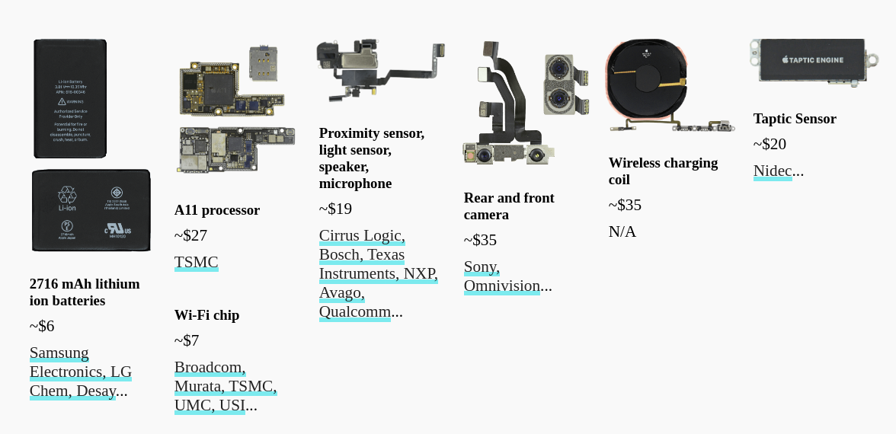

# iPhone Suppliers 📱

This is an expansion piece of Bloomberg Graphics' wildly popular ["What’s Inside All the iPhones"](https://www.bloomberg.com/features/apple-iphone-guts/). This project was my first forray into data journalism.

## About

Ever wondered what's inside an iPhone? You don't have to smash your phone. Someone already did, and I took a look inside. This is just a snippet of what you're about to see.



## Installation

Using npm:

```
npm install
```

Start the app:

```
npm start
```

Visit your localhost:8080 and voila~ Enjoy the graphics! 📊 📉

## Public URL

If you don't want to bother installing and locally hosting this application, I have great news for you. The project is also deployed on Netlify. Check out this [link](https://iphone-supply-chain.netlify.app/). 

## Methodology

1. Download Apple's Annual [supplier list](https://www.apple.com/supplier-responsibility/pdf/Apple-Supplier-List.pdf). I wish it was a CSV, but PDF will do.

2. Scrape the PDF. I used a Java program called Tabula to identify and parse most of the tables.

3. Clean the data. Make sure the addresses are real.

4. Use Google's [Geocoding](https://developers.google.com/maps/documentation/geocoding/) API to derive the lat lon coordinates.

5. Validate the lat lon coordinates. Silly, Google! Shenzhen is not in Texas. Or is it? 

6. Use [Pandas](https://github.com/pandas-dev/pandas) (🐼) library to conduct preliminary data analysis.

7. Start graphing/coding!

## Credits

Many thanks to the people at Bloomberg, especially Max Chafkin and Ian King who published this wildly popular piece in the Fall of 2017. Their work has long been an inspiration to me, and I would like to thank them for their crisp images of each iPhone component that are the foundations for my own piece.